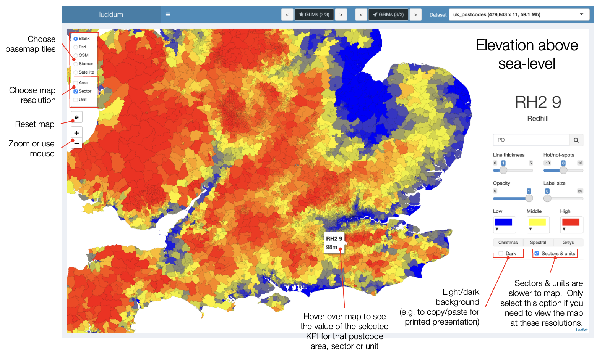

# 1. lucidum

lucidum is an open source R Shiny app to help users build and communicate GLMs and GBMs without writing code.  

lucidum works with standard R data.frames and data.tables and is designed to make model building more interactive,  visual and insightful.

I originally wrote lucidum to automate the repetitive tasks involved when building the types of regression models common to UK personal lines insurers.  More recently, I have used it as a tool to help insurers move from GLMs to GBMs (specifically [LightGBM](https://github.com/microsoft/LightGBM)), using SHAP values to understand and communicate model features and interaction effects.

lucidum's functionality includes:

* **Collection of metadata to support a modelling exercise**
  - define modelling KPIs (e.g. frequency by claim peril)
  - filters to apply to charts and maps (e.g. new business vs renewals)
  - base levels and bandings to apply when tabulating a GLM
  - setup feature scenarios for inclusion in a GBM  
* **Interactive charting**
  - actual vs expected charting by rating factor, with easy access to filters and training vs test views
  - plot several models' predictions (GLMs and GBMs) simultaneously
  - user-defined banding for continuous features - no "pre-banding" required
  - overlay "single profile" lines for GLMs to understand the underlying model effect
  - overlay SHAP value ribbons for GBMs to understand the underlying model effect
  - automated "residual error" analysis to identify poorly fitting features  
  
  

* **Interactive mapping of data at UK Postcode Area, Sector and Unit resolution**  
  - uses the [leaflet](https://github.com/Leaflet/Leaflet) library to draw choropleth maps for Postcode Area and Sector
  - uses open source shapefiles for Area and Sector, rendered down to a lower resolution to work well in the browser
  - Unit level plots at the centroid of individual Postcode Units  
  
  

* **Support a GLM build**  
  - "formula helper" to make the job of building an R GLM formula much faster
  - convert GLMs to tabular format ("ratebooks") with user-defined bandings and base levels
  - export tabulated GLMs as Excel workbooks  
  
  

* **Support a GBM build**  
  - provide a simple user interface for GBM feature selection
  - provide a simple user interface to the most common LightGBM parameters
  - build GA2M models (1D+2D GBMs) to support interaction detection
  - use feature interaction constraints to build indices for high cardinality features like postcode
  - 1D SHAP plots to interpret the model's main effects
  - 2D SHAP plots to  interpret interaction effects  
  
  

## 2. Installation

You can install the development version of lucidum from [GitHub](https://github.com/) with:

``` r
# install.packages("devtools")
devtools::install_github("SpeckledJim2/lucidum")
```

## 3. Load a dataset into lucidum

Option 1: use the dropdown menu to choose a data.frame or data.table to load into lucidum

``` r
library(lucidum)
lucidum()
```

Option 2: supply the data.frame or data.table name as an argument to lucidum

``` r
library(lucidum)
lucidum(your_dataframe_name)
```
## 4. lucidum navigation

* **Use the header controls to navigate models and datasets**
  
  
  
  
* **Use the sidebar to navigate lucidum, set the model response and weight and apply filters**
  

## 5. Training and test rows

To separate training and test rows in your dataset, include a numerical column called "train_test" with value 0 for training and 1 for test.

## 6. Specification files

Specification files make lucidum more useful by specifying metadata to make model building faster.  

Specification files are .csv files which can be created within lucidum itself or in a text editor.
You don’t have to use specification files, but they make life easier if you are going to be working with a dataset on a regular basis.

The specification file formats are described in the app - for example the KPI specification screen follows:
  

There are three types of specification files:  

1. KPI specification: the metrics you want to access quickly in the app’s sidebar  
2. Filter specification: formulae that define filters you want to apply to charts and maps  
3. Feature specification: quicker access to features in ChartaR and feature scenarios that you want to use in your models

Save the specification files in folders called: “kpi_specifications”, “filter_specifications” and “feature_specifications”.  
Specification files should have the same name as your dataset, i.e. if the dataset is called “football” the specification files should be called “football.csv”

Set the path to the specification files before running library(lucidum) or it won’t pick up the path:
``` r
	options(lucidum=list(specification_path=“my_path”))
	library(lucidum)
	lucidum(my_dt)
```

If you want to change the path without restarting R, you need to detach lucidum and reload the library:
``` r
	detach("package:lucidum", unload = TRUE)
	options(lucidum=list(specification_path=“my_different_path”))
	library(lucidum)
```

## 7. lucidum tips

* **Dataset**
  - data.tables will retain any new columns created after quitting lucidum - useful if you build a model and want to use the predictions elsewhere
  - data.frames will not retain any new columns built in lucidum.
  - The first numerical dataset column will be set as the response when you first load lucidum.
  - Create a column “train_test” to distinguish training rows (value 0) from test rows (value 1).  Lucidum won’t generate this column for you, you need to supply it and make sure it’s a sensible split.
  - Identifier columns with unique values on larger datasets (>100k) will be slow if selected in ChartaR as it first checks how many levels are in the feature before plotting.  I use the feature specification to put identifier type columns into a feature grouping, so I don’t include them in a model by mistake.
  
* **How to build models on a subset of the data**
  - Use a weight column with zeroes to remove those rows from the training data.
  - You must ensure that the corresponding response is also zero for those rows (e.g. you would not expect non-zero incurred claims on a row with zero claims).
  
* **User interface**
  - You can change lucidum browser zoom level as for any other webpage.
  - MappaR will sometimes not refresh if you have changed the zoom level while on another tab.  If this happens, zoom in and back out and the map will reappear.
  
* **Operations that can be slow running**
  - SHAP values on deep trees built on large datasets can be very slow to generate.  Turn off the option to generate SHAP values if you don’t need them, or use lower number of trees, higher learning rates and fewer number of leaves when first exploring a GBM build with SHAP values.
  - Summarising by character columns is slower than summarizing by factor columns, so convert character columns to factors before loading into lucidum.

* **Bugs**
  - You can change the displayed dataset freely (using the top right control) before building any models, but once you have built a model avoid changing the dataset as you can’t in general apply a model built on dataset A to dataset B.
  - There is no error checking for invalid monotonicity parameters or additional parameters in BoostaR – if you use something incorrect LightGBM will throw an error and the app will stop.
  - shinyAce doesn’t start automatically when first loading lucidum.  A workaround is to run the command shinyAce::aceEditor(outputId = NULL) in the console before library(lucidum).
  - The 10k option for SHAP values generates the SHAP values correctly for a random 10k sample of the data, but the SHAP ribbons don’t yet display correctly in ChartaR.
  - R GLMs store the entire modelling dataset by default as part of the model object.  When you save a dataset out from GlimmaR, lucidum strips the dataset from the .RDS glm object to make the file a sensible size.  However, this stripping out doesn’t occur until the model is saved and so if several GLMs are built within GlimmaR on very large datasets RAM usage will increase.
